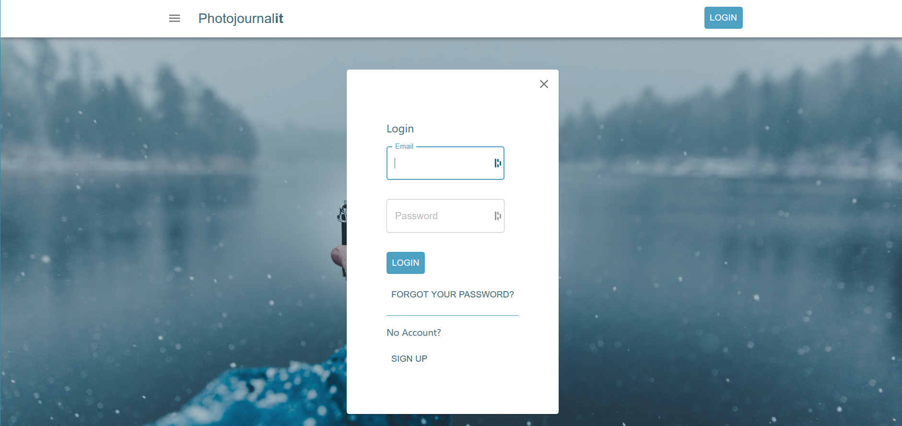
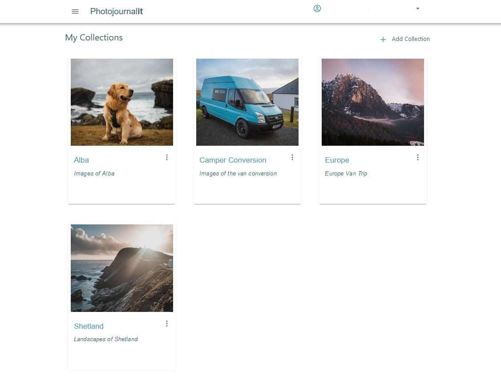
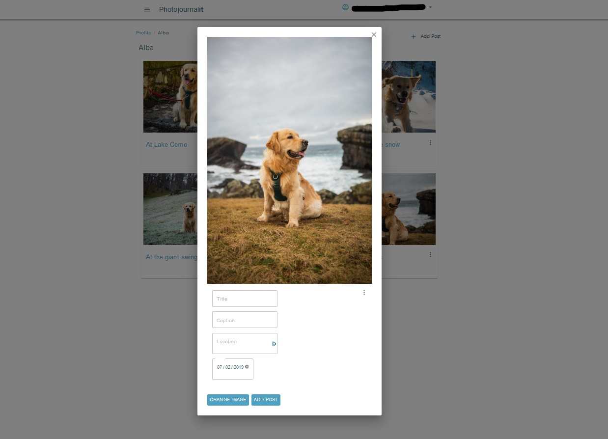
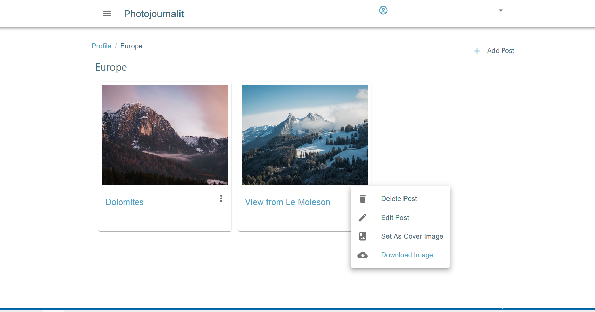
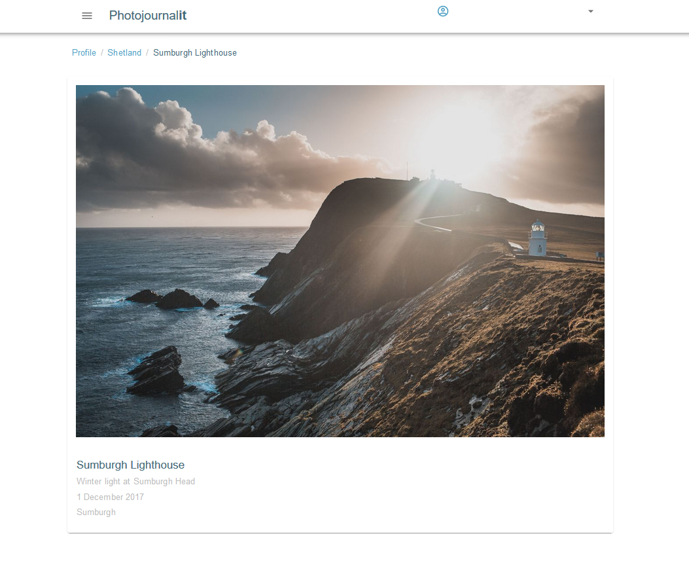

Photojournalit is a photo storing website built using React and AWS Amplify.

---

It features authentication built on AWS Cognito which allows users to register, login & reset forgotten passwords.

---

Once logged in the user can create a collection.  The collections are listed on the user's profile page.

---

Within each collection, new posts can be added through the Add Post form. Using GraphQL subscriptions the list of posts is automatically updated on upload of the new post.

---

Posts can be edited, downloaded, assigned to the collection cover,or deleted.  Each collection and post is stored in AWS Dynamo DB and the images are stored in AWS S3 storage.

---

The posts can be viewed individually, with the option to navigate to the previous and next image in the collection.