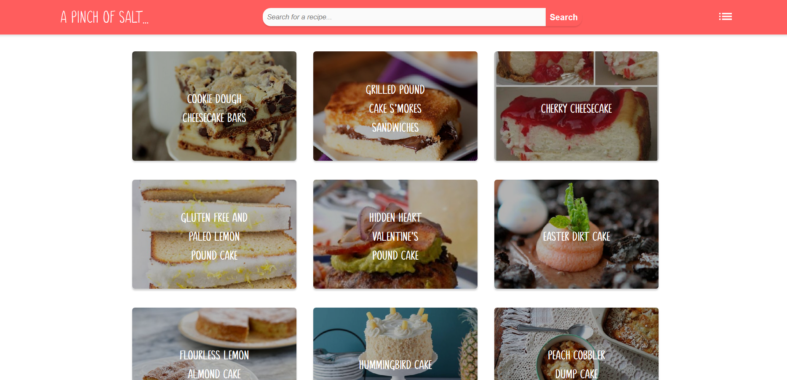
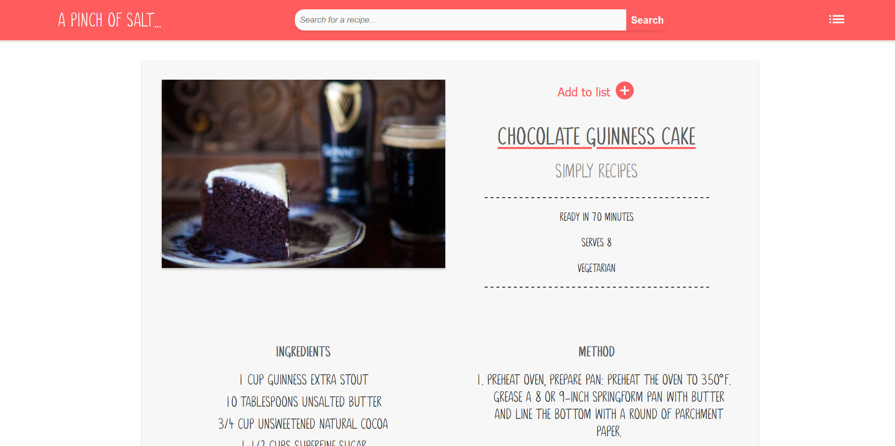
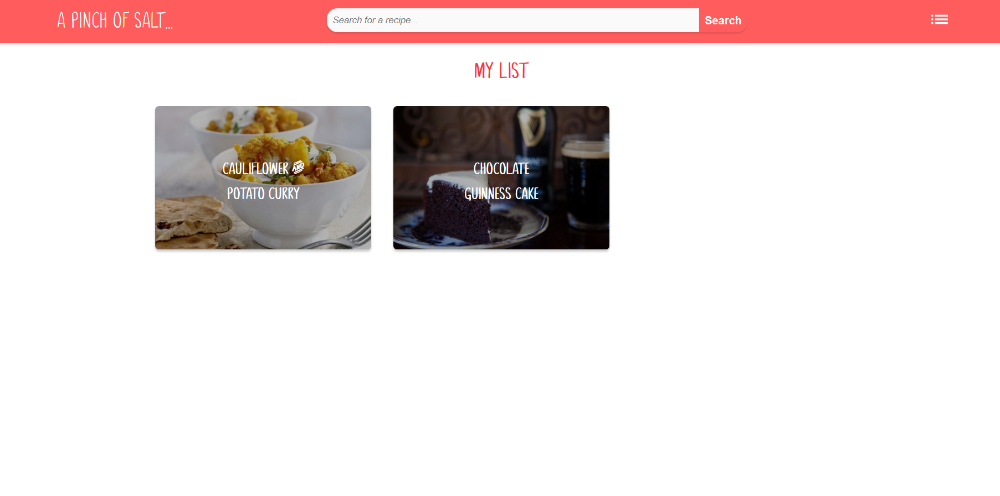

Built to help learn working with the MERN stack(MongoDB, Express, React & Node), this site utilises the Spoonacular API to search a database of recipes and provide results that display images, ingredients and the steps for using the recipe. No authentication has been added to the site but the user can save recipes to a list which is stored in Mongo DB Atlas.

Built using:

- React.JS
- Node.JS
- Express.JS
- REST APIs
- CSS
- Responsive Design
- Javascript/ES6
- MongoDB
- Adobe XD